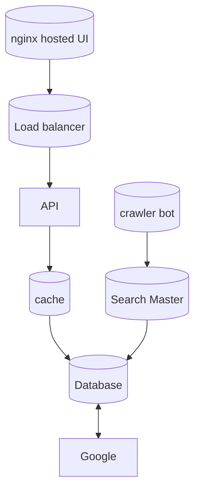

The project is going to be hosted on Kubernetes largely because I have a kube cluster and I really don't want to pay for cloud costs if I can avoid it, but if I need later I can go down that road. This will largely be in two parts a publicly exposed part, and a private part. 

[[ui]]